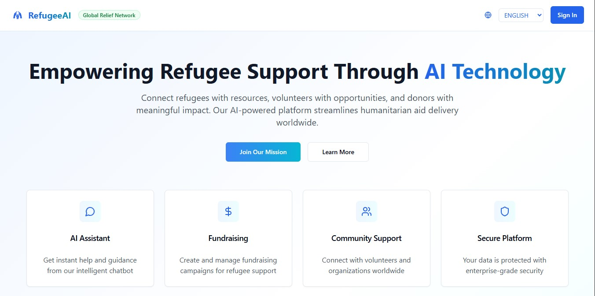
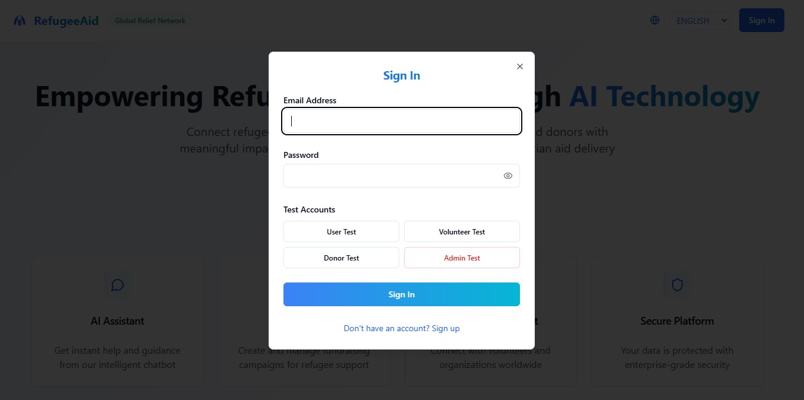
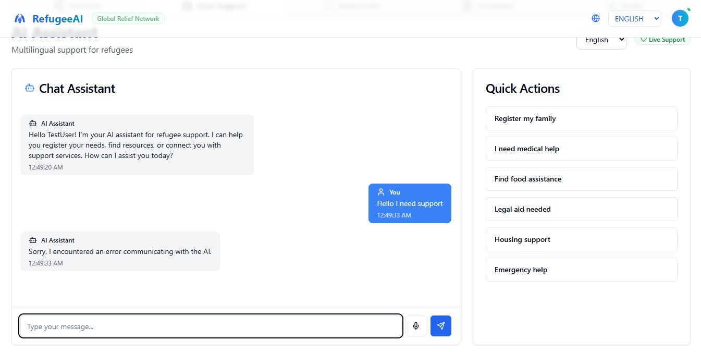
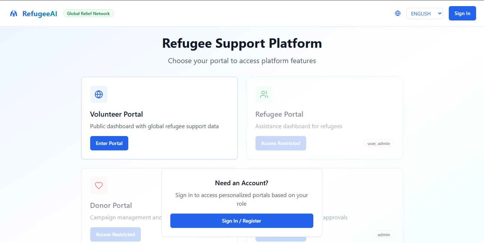
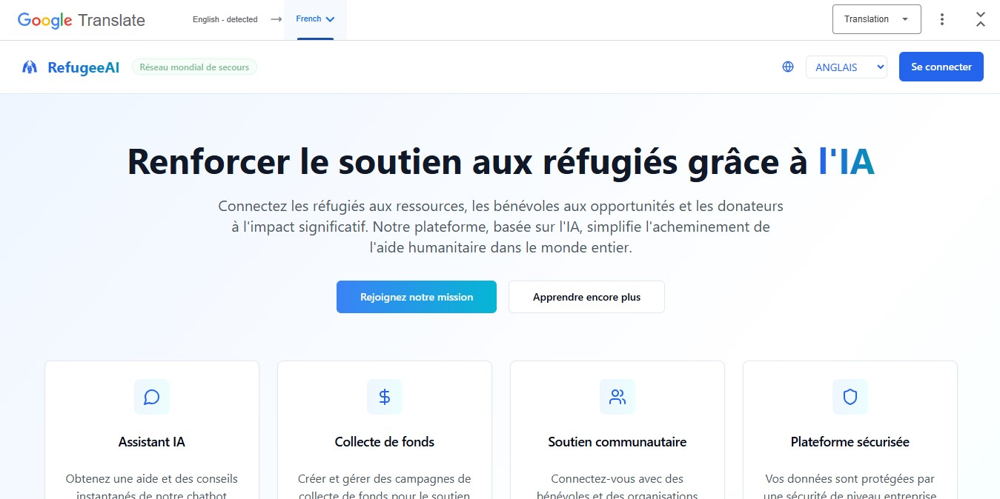

# 🌍 RefugeeAid: AI-Powered Humanitarian Platform

RefugeeAid is an AI-powered multilingual platform designed to assist refugees by intelligently coordinating fundraising, distributing critical supplies, and facilitating emotional, legal, and integration support—all in one agentic system. The platform connects NGOs, donors, volunteers, and refugees in real-time, with built-in support for offline operation in low-connectivity zones.


[](https://youtu.be/lsFeSM_KoHE)
[](submission_materials/pitch_deck.pdf)
[](https://refuge-ai-compass.vercel.app)


---

## 🧨 Problem Statement

Over 100 million people worldwide are currently displaced due to war, persecution, or climate disasters. Refugees often struggle to access:

* Accurate and timely information about services.
* Urgent and long-term supplies.
* Mental health and legal support.
* Pathways to integrate into host communities.
* Equitable access to education and employment.

This disconnection results in inefficient aid delivery, unverified need requests, duplicated efforts, and prolonged hardship.

---

## 🚀 Solution

RefugeeAid bridges the gap between need and aid by acting as a digital social agent that:

* **AI-Powered Chat Support**: Provides multilingual, real-time assistance to refugees for navigating housing, education, healthcare, and legal systems.
* **AI Agents for Aid Solicitation**: Automatically matches refugee needs with verified donor resources and solicits aid intelligently.
* **Predictive Analytics**: Uses AI to forecast resource needs and optimize distribution.
* **Offline AI Support**: Ensures emergency assistance and resource access even in low-connectivity zones.
* Facilitates equitable distribution of funds and resources.
* Offers credit and trust scoring to improve visibility to donors and agencies.

---

## 🛠️ Technology Stack

### Frontend

* React (with TailwindCSS)
* Service Workers and PWA (for offline and emergency aid)
* TypeScript (Type-safe development)
* Shadcn/ui (Modern component library)

### Backend

* FastAPI
* Supabase (Database + Authentication)

### AI & Machine Learning
* **Pure ANN** to estimate displaced people based on current economic factors and natural events
* **Prophet for forecasting resource depletion in foreign camps**.
* **Cosine Similarity** to match donors with organizations
* **Google Translate API** for multilingual interactions.
* **Reddit Bot** For automated publicity and soliciting for aid

---

## 🌟 Key Features

### 🌐 Home Page

* Mission statement and platform summary.
* Feature highlights: AI Assistant, Fundraising, Community Support, Secure Platform.
* Live statistics: Active Cases, Funds Raised, Resources Delivered.
* Call-to-action for new users.

### 🧑‍💼 Admin Panel

* Overview of platform analytics.
* Manage approvals, alerts, users, and campaigns.
* Metrics: Pending approvals, active campaigns, registered refugees, critical alerts.
* Analytics: User satisfaction and response times.
* **AI-Driven Insights**: Predictive analytics for resource planning and impact measurement.

### 🤝 Volunteer Portal

* Dashboard for case tracking and regional impact.
* Real-time updates: New cases, donations, deliveries, alerts.
* Visual insights on regional activity (Middle East, Europe, Africa).
* **AI Recommendations**: Suggests optimal resource allocation and volunteer assignments.

### 🔐 Donor Portal

* Launch/manage fundraising campaigns.
* View donation history.
* Track the impact of contributions.
* Smart Campaign Filter.
* Crypto Wallet to manage donations.
* **AI Transparency Reports**: Provides donors with detailed insights into the impact of their contributions.

### 🧍 Refugee Portal

* **AI Chat-Based Assistance**: Multilingual support for submitting aid requests and navigating resources.
* Monitor delivery status.
* Access support resources.
* **Offline AI Support**: Ensures access to critical information even in low-connectivity areas.

### Offline and Emergency Support

* PWA Mode enables access to last synced data (requests, maps, legal resources).
* Data syncs automatically when reconnected.
* Emergency responses prioritized and stored locally.
* **AI-Driven Emergency Alerts**: Automatically identifies and prioritizes critical cases.

---

## 🔒 Role-Based Access Control (RBAC)

* **Admin**: Full access to all system operations and analytics.
* **Volunteer**: Manage cases, deliveries, and regional outreach.
* **Donor**: Fund and monitor humanitarian campaigns.
* **Refugee**: Receive support, chat with AI assistant, request aid.

---

## Use Guide
- The landing page for the website


- User can sign in (test accounts for different roles)


- After signin refugees can use the chat feature with case suggestions to speed up info getting in case of emergencies


- Based on User sign in and registered roles, access to other portals are controlled


- Internationalisation and multi-language support and language conversions



### Registration and Login 
Users sign in and have privileges and access based on their roles.
There are 4 levels of access:
- General / World access
- Donor Access
- User (Refugee) Access
- Admin Access

### Setup and Info 
Users can register their info and upload documents.
Access to AI powered chat features to aid and support as well as inform the of possible jobs or emergencies 

### Emergency View 
When Offline or in case of poor connection access to last Retrieved important information is made available for use.


## 🚀 Quick Setup Guide

### Prerequisites

* Node.js ≥ 18
* PostgreSQL ≥ 14

### Clone the Repository

```bash
git clone https://github.com/ProfBee-dot/refuge-ai-compass.git
cd refuge-ai-compass
```

### Install Dependencies

```bash
npm install
```

### Environment Setup

Create a `.env.local` file and include:

```
DATABASE_URL=
SUPABASE_CONFIG=
OPENAI_API_KEY=
GOOGLE_TRANSLATE_API_KEY=
```

### Database Setup

```bash
npx prisma migrate dev --name init
```

### Start Development Server

```bash
npm run dev
```

---

## 📋 Test Accounts

| Role      | Email                                                 | Password    |
| --------- | ----------------------------------------------------- | ----------- |
| Volunteer | [test.volunteer@mail.com](mailto:test.volunteer@mail.com) | password123 |
| Refugee   | [test.refugee@mail.com](mailto:test.refugee@mail.com)   | password123 |
| Admin       | [test.ngo@mail.com](mailto:test.admin@mail.com)           | password123 |
| Donor     | [test.donor@mail.com](mailto:test.donor@mail.com)       | password123 |

---

## 🎥 Demo & Resources

### 📸 Screenshots


### 📹 Video Demo

[Watch Demo on youtube](https://youtu.be/lsFeSM_KoHE)

### 📊 Pitch Deck

[View Pitch Deck (PDF)](submission_materials/pitch_deck.pdf)
[View Pitch Deck (Slides)](submission_materials/pitch_deck.ppt)

### 🌐 Live Application

[Try the App](https://refuge-ai-compass.vercel.app)

---

## 🏗️ Project Structure

```
/app              - React app
/components       - Reusable UI components
/utils            - Helper functions
/supabase         - Prisma schema and DB logic
/api              - REST & RPC endpoints
/local_cache      - Offline data cache (for PWAs)
```

---

## 🌍 Language Switching

Users can change languages at any point via the floating language selector. All backend messages are auto-translated using Google Translate API with fallback to English.

---

## 🔒 Security & Privacy

* All data encrypted in-transit (HTTPS).
* Refugees control visibility of sensitive data (e.g., identity docs).
* Anonymous reporting supported.
* Offline data cached with local encryption.

---

## 🎯 Impact & Metrics

### Target Audience

* Displaced refugees.
* NGOs and humanitarian organizations.
* Donors and volunteers.
* Government support agencies.

### Expected Outcomes

* Faster and more targeted resource allocation.
* Reduced aid duplication and fraud.
* Improved mental health via supportive agents.
* Better integration through employment, legal, and education pathways.

---

## 🚀 Future Roadmap

* 🧠 Federated AI agents for hyperlocal knowledge.
* 🤝 Blockchain transparency layer for aid tracking.
* 📸 Image/video-based damage reporting (computer vision).

---

## 🙏 Acknowledgments

* Hackathon organizers and mentors.
* Refugees and volunteers who shared their stories.

---

## Contributors

* **Product Design**: Adebisi Jethro.
* **Frontend Development**: David Uwagbale.
* **Backend Development**: Zoaka Bata Bukar.
* **AI Integration**: Keshinro Mus'ab.

**Project Lead**: Alfred Itodole.
